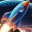

# Arkanoo 

[](https://rust-lang.org/) [](https://deepmind.google/models/gemini/pro/) [](https://www.anthropic.com/claude/sonnet) [](https://c0m4r.itch.io/arkanoo)

A fully-featured Arkanoid/Breakout game written in Rust.


## Download

https://github.com/c0m4r/arkanoo/releases

[](https://c0m4r.itch.io/arkanoo)

## Features

- 🎯 **Campaign & Infinite Mode** - 9 handcrafted levels followed by endless procedurally generated stages.
- 📋 **Level Patterns**:
  - **Levels 1-9**: Unique handcrafted patterns (Grid, Checkerboard, Stripes, Pillars, etc.)
  - **Levels 10+**: Infinite procedurally generated block layouts.
- 🌪️ **Spin Mechanic** - Curve the ball's trajectory by moving the paddle during impact.
- 🎁 **Bonus System** - Random drops (15% chance):
  - ⚽ **Extra Ball** - Spawns a second ball (40% of drops)
  - 📏 **Long Paddle** - Extends paddle width temporarily (40% of drops)
  - 👻 **Ghost Ball** - Balls pass through blocks for 10 seconds (10% of drops, rare)
  - 🚀 **Rocket** - Launch explosive rockets with Space (10% of drops, rare)
- 🎯 **Scoring System**:
  - +10 points per block destroyed
  - +5 points for each paddle reflection
  - +2 points for each bonus collected
  - -20 points for losing a life
- 💥 **Rocket Weapon**:
  - Fire rockets with **Spacebar** when ammo available
  - Visual cannon indicator appears on paddle
  - Blinking "press space to launch" text
  - Rockets explode on impact, destroying blocks in 2-block radius
- 📊 **HUD** - Score display and lives shown as ❤️ red hearts
- 💔 **Heart Shatter Effect** - Hearts shatter into particles when lives are lost
- ⏸️ **Interactive Menu** - Click buttons or use keyboard:
  - Resume, Restart, Settings, Quit
  - Volume control slider
  - Sound mute/unmute toggle
  - Resolution options (1280×720, 1920×1080, 2560×1440) with 5-second confirmation
  - Fullscreen toggle
- 🎵 **Dynamic Music** - 6 unique songs, one for each level
- 🔊 **Audio** - MP3 support with multiple sound effects
- 🌆 **Procedural Backgrounds** - 6 distinct animated themes (Matrix, Nebula, Tron Grid, etc.) that are randomized for infinite variety.
- 🖱️ **Mouse Control** - Control paddle with mouse movement
- 🏆 **Level Transitions** - Win animations and prompts between levels
- ✨ **Particle Effects** - Glass-shattering particles when blocks are destroyed and hearts shatter

<video src="https://github.com/user-attachments/assets/47f5c644-4434-4ea0-9d2b-bda05203688c"></video>

## Visual Enhancements

- **Gradient Blocks** - Top-to-bottom color fade on each block
- **Glass Effects** - Semi-transparent overlays on blocks and paddle
- **Symbolic Bonuses** - Easy-to-recognize icons for all bonus types
- **Heart Lives** - Lives displayed as red heart shapes (PNG texture)
- **Heart Shatter Animation** - Hearts explode into crimson particles when lives are lost
- **Rocket Visuals** - Detailed rocket projectiles with nose cone, fins, and flame trail
- **Cannon Indicator** - Visual cannon appears on paddle when rockets are available
- **Procedural Backgrounds** - 6 stunning, randomized themes (Cyber Grid, Star Voyage, Hex Pulse, Aurora Waves, Matrix Rain, Nebula Clouds).
- **Visual Feedback** - Paddle glows and discharges energy when spin is applied.
- **Smooth Animations** - Particle effects and transitions
- **Scalable Graphics** - Resolution options with crisp font rendering at all resolutions
- **Safe Resolution Changes** - 5-second confirmation prevents accidental resolution issues

## Controls

| Key/Action | Function |
|-----|--------|
| ← / → | Move paddle left/right (keyboard) |
| Mouse Movement | Move paddle left/right (in-game) |
| **Space** | **Fire rocket (when available)** |
| Left Click | Start next level (during transitions) |
| ESC | Pause/Resume game |
| F11 | Toggle fullscreen |
| R | Restart (in pause/game over) |
| Q | Quit (in pause/game over) |

**In Pause Menu:**
- Resume - Continue game
- Restart - Start new game
- Settings - Adjust audio settings
- Quit - Exit game

**In Settings:**
- Sound Toggle - Enable/disable all audio
- Volume Slider - Adjust music and sound effect volume (0-100%)
- Resolution - Cycle through available resolutions with 5-second confirmation (1280×720, 1920×1080, 2560×1440)
- Fullscreen - Toggle fullscreen mode

## Building

### Prerequisites

#### Linux

Install SDL2 development libraries:

```bash
# Debian/Ubuntu
sudo apt-get install libsdl2-dev libsdl2-mixer-dev libsdl2-ttf-dev libsdl2-image-dev

# Fedora
sudo dnf install SDL2-devel SDL2_mixer-devel SDL2_ttf-devel SDL2_image-devel

# Arch
sudo pacman -S sdl2 sdl2_mixer sdl2_ttf sdl2_image
```

#### Windows

Building on Windows requires additional setup:

**1. Install Visual Studio Build Tools**

Download and install:
- [Visual Studio Build Tools](https://aka.ms/vs/stable/vs_BuildTools.exe)

**2. Install CMake (version 3.31.10)**

Download and install from either:
- [CMake Official](https://cmake.org/files/v3.31/cmake-3.31.10-windows-x86_64.msi)
- [CMake GitHub Mirror](https://github.com/Kitware/CMake/releases/download/v3.31.10/cmake-3.31.10-windows-x86_64.msi)

**3. Download SDL2 Prebuilt Binaries**

Download the latest Windows development libraries from:
- [SDL2](https://github.com/libsdl-org/SDL/releases) - Main SDL library
- [SDL2_ttf](https://github.com/libsdl-org/SDL_ttf/releases) - TrueType font support
- [SDL2_image](https://github.com/libsdl-org/SDL_image/releases) - Image loading (PNG)
- [SDL2_mixer](https://github.com/libsdl-org/SDL_mixer/releases) - Audio mixing (MP3)

**4. Extract and Organize SDL Files**

In your `arkanoo` directory (next to `Cargo.toml`):
1. Extract all `.lib` files from the downloaded SDL archives to the root directory
2. Combine all `include` folders from each SDL library into a single `include` directory
3. Your directory structure should look like:
   ```
   arkanoo/
   ├── Cargo.toml
   ├── SDL2.lib
   ├── SDL2_ttf.lib
   ├── SDL2_image.lib
   ├── SDL2_mixer.lib
   ├── include/
   │   └── SDL2/
   │       ├── *.h (combined headers from all SDL libraries)
   └── src/
   ```

### Required Assets

Place the following files in the `assets/` directory:

**Audio:**
- `ball.mp3` - Ball bounce sound effect
- `oh.mp3` - Sound when life is lost
- `load.mp3` - Sound when launching rocket
- `breaking-glass.mp3` - Sound when rocket explodes
- `song1.mp3` through `song6.mp3` - Background music (one per level)

**Graphics:**
- `background1.png` through `background6.png` - Background images (one per level)
- `heart.png` - Heart icon for life display

### Compile

```bash
cargo build --release
```

The binary will be at `target/release/arkanoo` (approximately 540 KB).

## Running

```bash
./target/release/arkanoo
```


## Game Rules

- Start with **3 lives** (shown as ❤️)
- **Scoring:**
  - Each block destroyed: **+10 points**
  - Each paddle reflection: **+5 points**
  - Each bonus collected: **+2 points**
  - Losing a life: **-20 points**
- **Bonuses** (15% drop chance):
  - **Extra Ball** (40%) - Adds an additional ball
  - **Long Paddle** (40%) - Extends paddle temporarily
  - **Ghost Ball** (10%, rare) - Balls pass through blocks for 10 seconds
  - **Rocket** (10%, rare) - Grants 1 rocket, fire with Space to create 2-block radius explosion
- **9-Level Campaign** with unique block patterns
- **Infinite Mode** unlocks after completing the campaign
- Clear all blocks in a level to proceed to the next
- Complete all 9 levels to beat the campaign!
- Game over if all lives are lost

## Menu Navigation

The pause menu features **clickable buttons** with hover effects:

- **Hover** - Buttons highlight when you move the mouse over them
- **Click** - Left-click to activate buttons
- **Volume Slider** - Click and drag to adjust volume in real-time
- **Sound Toggle** - Instantly mute/unmute all audio

## Project Structure

```
arkanoo/
├── src/
│   ├── main.rs         # Entry point & game loop with menu integration
│   ├── entities.rs     # Game entities (Paddle, Ball, Block, Bonus, Particle, Rocket)
│   ├── game.rs         # Core game logic with scoring and bonuses
│   ├── rendering.rs    # Graphics with gradients, glass effects, particles, rockets
│   ├── audio.rs        # Level-based music management and sound effects
│   └── menu.rs         # Interactive menu with settings and resolution confirmation
├── assets/
│   ├── ball.mp3        # Bounce sound effect
│   ├── oh.mp3          # Life lost sound
│   ├── load.mp3        # Rocket launch sound
│   ├── breaking-glass.mp3  # Rocket explosion sound
│   ├── song1.mp3       # Level 1 music
│   ├── song2.mp3       # Level 2 music
│   ├── song3.mp3       # Level 3 music
│   ├── song4.mp3       # Level 4 music
│   ├── song5.mp3       # Level 5 music
│   ├── song6.mp3       # Level 6 music
│   ├── background1.png # Level 1 background
│   ├── background2.png # Level 2 background
│   ├── background3.png # Level 3 background
│   ├── background4.png # Level 4 background
│   ├── background5.png # Level 5 background
│   ├── background6.png # Level 6 background
│   └── heart.png       # Heart life icon
└── Cargo.toml
```

## Dependencies

Minimal dependencies as requested:

- `sdl2` (with mixer, ttf, image features) - Graphics, input, audio, and text rendering
- `rand` - Random number generation for bonus drops and song selection

## Troubleshooting

### No Audio
- Ensure all MP3 files are in `assets/` directory:
  - Music: `song1.mp3` - `song6.mp3`
  - Sound effects: `ball.mp3`, `oh.mp3`, `load.mp3`, `breaking-glass.mp3`
- Check file permissions (read access required)
- Verify SDL2_mixer is installed with MP3 support

### Background Not Showing
- Ensure all background PNG files (`background1.png` - `background6.png`) exist in `assets/`
- Verify SDL2_image is installed with PNG support

### Font Issues (Windows)
- The game uses `C:\Windows\Fonts\Arial.ttf` on Windows
- Ensure the font file exists or modify `src/main.rs` to use a different font

### Font Issues (Linux)
- The game uses `/usr/share/fonts/truetype/dejavu/DejaVuSans.ttf` on Linux
- Install DejaVu fonts if missing: `sudo apt-get install fonts-dejavu-core`

## License

- arkanoo: WTFPL / effectively Public Domain / Copyright (C) 2025 c0m4r
- SDL2: zlib license / Copyright (C) 1997-2025 Sam Lantinga <slouken@libsdl.org>

## Authors

Code: Gemini 3 Pro (High) / Claude Sonnet 4.5 (Thinking) / c0m4r

Logo and backgrounds has been AI generated by Gemini 2.5 Flash Image (Nano Banana)

## Credits

Sounds and music from https://pixabay.com/music/
